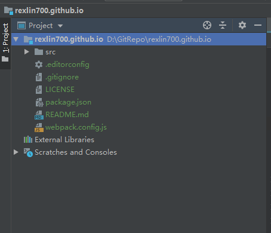

## 在线Markdown转换器

可以用来快速的将Markdown文章转换到微信公众号支持的格式，该工具基于以下项目修改所得。

- [online-markdown by barretlee](https://github.com/barretlee/online-markdown)
- [online-markdown by dyc87112](https://github.com/dyc87112/online-markdown.git)

## 使用方式

> 以下操作不会的可以百度，笔者也不太会，也是百度的。

- 安装 `node` 环境，运行 `npm install`
- 安装 `webpack`
- 项目根路径运行 `webpack` 打包 --> 直接生成文件到根目录
- 访问 `rexlin700.github.io` 即可，初始项目结构如下（其他问价年均为打包生成的文件或目录）：
- 
- 打包后的结构如下
- 

## LICENSE

MIT. Thanks for @Phodal. @barretlee @dyc87112
